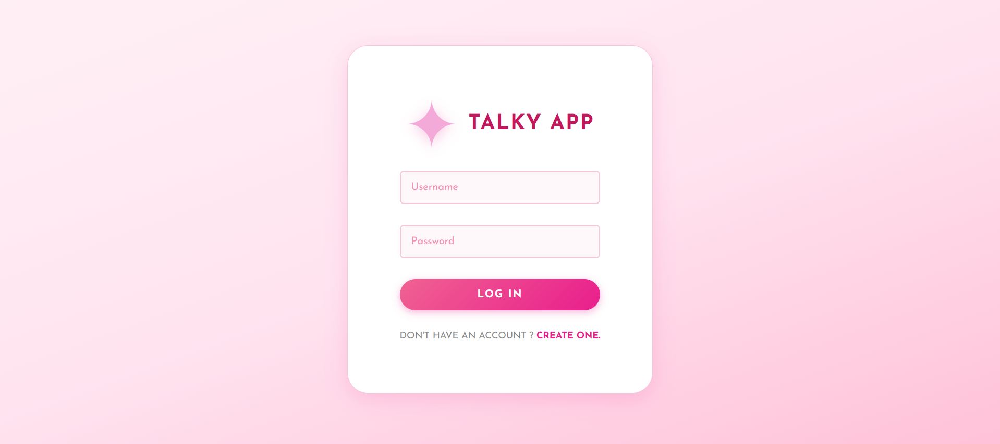
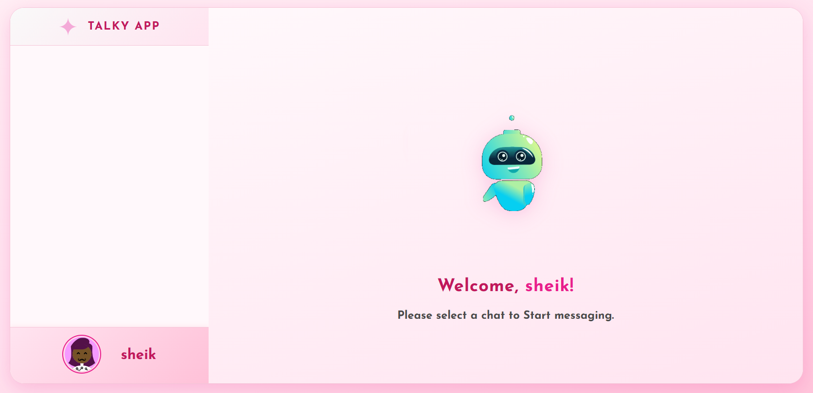

# ✨ Talky App — Real-Time Chat Application

> A beautiful real-time chat application built with the MERN Stack and Socket.io




---

## 🚀 Features

- 🔐 **User Authentication** — Register & Login securely
- 🎭 **Avatar Selection** — Pick a unique avatar after registration
- 💬 **Real-Time Messaging** — Instant messaging powered by Socket.io
- 👥 **Multiple Users** — Chat with any registered user
- 🔒 **Password Hashing** — Bcrypt keeps passwords safe
- 📱 **Responsive UI** — Clean and modern pink-themed design

---

## 🛠️ Tech Stack

### 🎨 Frontend
| Technology | Purpose |
|---|---|
| React.js | UI Framework |
| Socket.io-client | Real-time communication |
| Axios | API requests |
| React Router DOM | Page navigation |
| Styled Components | CSS styling |
| React Toastify | Toast notifications |
| Multiavatar | Avatar generation |

### ⚙️ Backend
| Technology | Purpose |
|---|---|
| Node.js | Runtime environment |
| Express.js | Web framework |
| Socket.io | Real-time communication |
| Mongoose | MongoDB object modeling |
| MongoDB | Database |
| Bcrypt | Password hashing |
| CORS | Cross-origin requests |
| Dotenv | Environment variables |

### 🧰 Tools
| Tool | Purpose |
|---|---|
| Git | Version control |
| Yarn | Package manager |
| Docker & Docker Compose | Containerization (optional) |

---

## 📁 Project Structure

```
chat-app-react-nodejs/
├── public/                  → React Frontend
│   ├── src/
│   │   ├── pages/
│   │   │   ├── Register.jsx     → Registration page
│   │   │   ├── Login.jsx        → Login page
│   │   │   ├── SetAvatar.jsx    → Avatar selection page
│   │   │   └── Chat.jsx         → Main chat page
│   │   ├── components/
│   │   │   ├── ChatContainer.jsx → Chat messages UI
│   │   │   ├── ChatInput.jsx     → Message input box
│   │   │   ├── Contacts.jsx      → Contacts sidebar
│   │   │   ├── Welcome.jsx       → Welcome screen
│   │   │   └── Logout.jsx        → Logout button
│   │   └── App.js               → Routes configuration
│   └── .env                     → Frontend environment variables
│
├── server/                  → Node.js Backend
│   ├── controllers/
│   │   ├── userController.js    → Auth logic
│   │   └── messageController.js → Message logic
│   ├── models/
│   │   ├── userModel.js         → User schema
│   │   └── messageModel.js      → Message schema
│   ├── routes/
│   │   ├── auth.js              → Auth routes
│   │   └── messages.js          → Message routes
│   ├── index.js                 → Server entry point
│   └── .env                     → Backend environment variables
│
└── docker-compose.yml       → Docker setup (optional)
```

---

## ⚙️ Installation & Setup

### Prerequisites
- [Node.js](https://nodejs.org/en/download)
- [MongoDB](https://www.mongodb.com/docs/manual/administration/install-community/)
- [Yarn](https://yarnpkg.com/)

### Step 1 — Clone the repository
```bash
git clone https://github.com/Rizwansheik666/chat-app-react-nodejs.git
cd chat-app-react-nodejs
```

### Step 2 — Setup environment variables

For server:
```bash
cd server
cp .env.example .env
```

Open `server/.env` and update:
```env
PORT=5000
MONGO_URL=mongodb://localhost:27017
```

For frontend:
```bash
cd public
cp .env.example .env
```

`public/.env` should have:
```env
REACT_APP_LOCALHOST_KEY="chat-app-current-user"
```

### Step 3 — Install dependencies

Backend:
```bash
cd server
yarn
```

Frontend:
```bash
cd public
yarn
```

### Step 4 — Start MongoDB
```bash
# Windows
net start MongoDB

# Linux/Mac
sudo systemctl start mongod
```

### Step 5 — Run the application

Backend (Terminal 1):
```bash
cd server
yarn start
```

Frontend (Terminal 2):
```bash
cd public
yarn start
```

Now open **http://localhost:3000** in your browser 🎉

---

## 🔄 How It Works

```
User opens browser (localhost:3000)
        ↓
React.js renders UI → React Router handles navigation
        ↓
User registers → Axios sends data to Express API
        ↓
Express → Bcrypt hashes password → Mongoose saves to MongoDB
        ↓
User logs in → User data saved in localStorage
        ↓
User picks avatar → Multiavatar generates options
        ↓
Chat page opens → Socket.io connects in real-time
        ↓
User sends message → Socket.io emits to server
        ↓
Server saves to MongoDB → Broadcasts to receiver instantly
```

---

## 🐳 Docker Setup (Optional)

```bash
docker compose build --no-cache
docker compose up
```

Then open **http://localhost:3000**

---

## 👨‍💻 Author

**Rizwan Sheik**
- GitHub: [@Rizwansheik666](https://github.com/Rizwansheik666)

---

⭐ If you found this project helpful, please give it a star!
